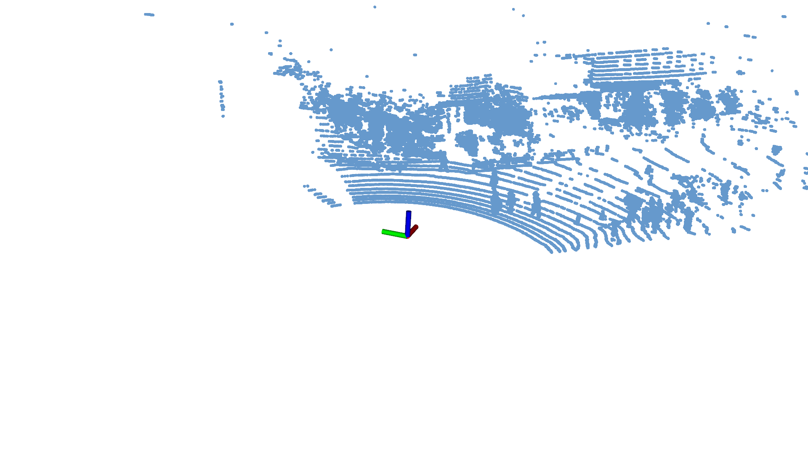
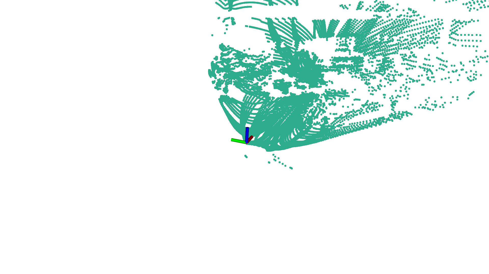
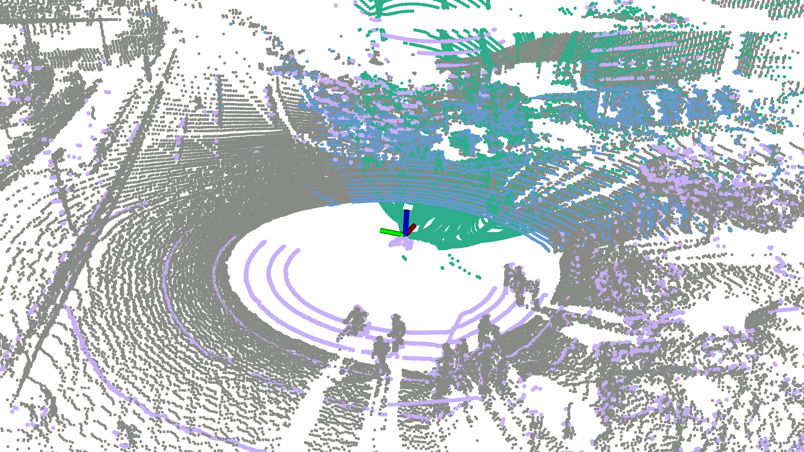
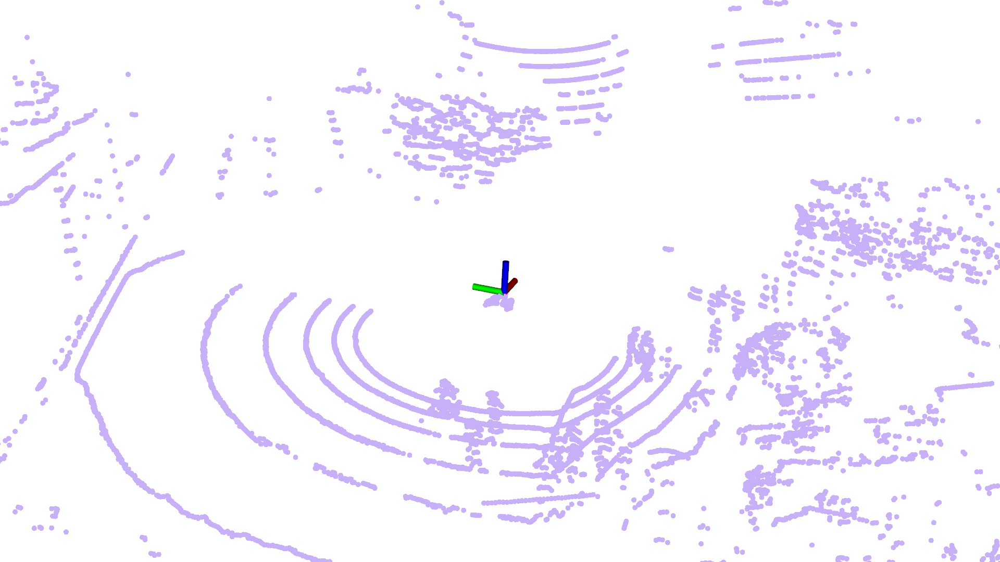
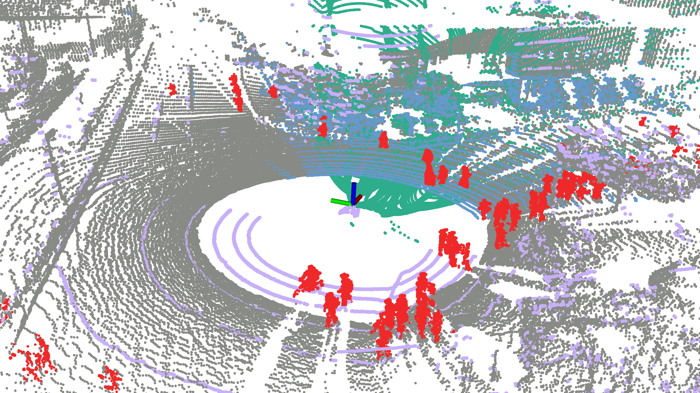
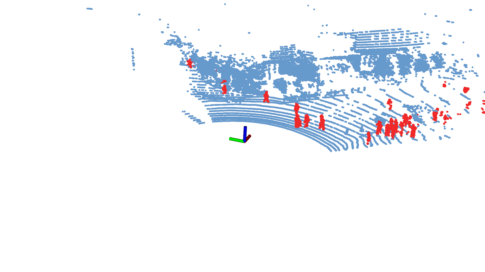
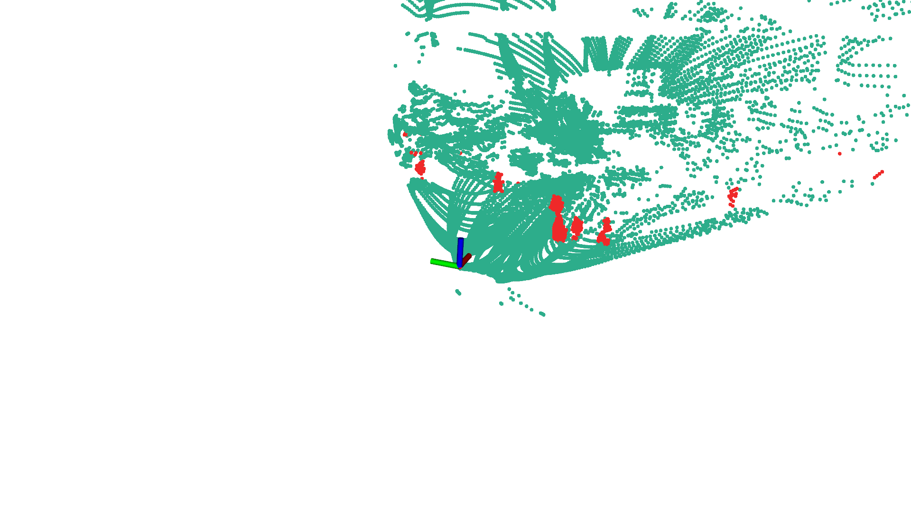
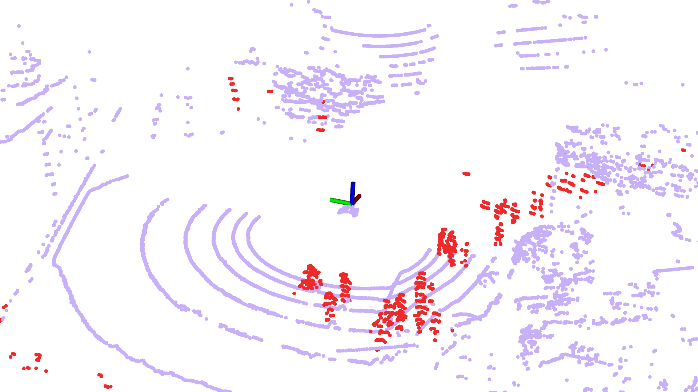
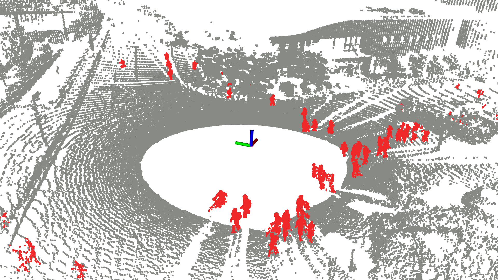

<div align="center">
    <h1>HeLiMOS Pointcloud Toolobox</h1>
    <a href="https://github.com/url-kaist/HeLiMOS-PointCloud-Toolbox"></a>
    <a href="https://github.com/url-kaist/HeLiMOS-PointCloud-Toolbox"></a>
    <a href="https://sites.google.com/view/heliprdataset"></a>
    <!-- a href="https://ieeexplore.ieee.org/document/9981561">
    <br />
    <br />
    <a href=https://urobot.kaist.ac.kr/>Video</a>
    <span>&nbsp;&nbsp;•&nbsp;&nbsp;</span>
    <a href="https://urobot.kaist.ac.kr/">Install</a>
    <span>&nbsp;&nbsp;•&nbsp;&nbsp;</span>
     <a href=https://urobot.kaist.ac.kr/>Paper</a>
    <span>&nbsp;&nbsp;•&nbsp;&nbsp;</span>
    <a href=https://urobot.kaist.ac.kr/>Contact Us</a>
  <br />
  <br />
  <p align="center"></p>

  [The HeLiMOS pointcloud toolbox](https://urobot.kaist.ac.kr/) is a data processing software for moving object segmentation (MOS) in the HeLiPR dataset.<br>It includes an effective merging-and-splitting-based approach ((a) and (g) in the upper figure) for labeling four heterogeneous LiDAR sensors.
</div>

## :package: Installation
What we need are just minimal dependencies.

```commandline
sudo apt-get install g++ build-essential libpcl-dev libeigen3-dev python3-pip python3-dev cmake -y
```


Next, clone and compile the HeLiPR-Pointcloud-Toolbox repository using git as follows:

```bash
git clone https://github.com/url-kaist/HeLiMOS-PointCloud-Toolbox.git
cd HeLiMOS-Pointcloud-Toolbox
mkdir build && cd build
cmake .. -DCMAKE_BUILD_TYPE=Release && make -j 16 
```

---

## 🔍 Overview 

The program is mainly composed of three modules: `helimos_saver`, `helimos_merger`, and `helimos_propagator`.  


- `helimos_saver` deskews and saves individual LiDAR data and pose data in the HeLiMOS format.
<p align='center'></p>

- `helimos_merger` synchronizes and combines the saved LiDAR data into a single merged cloud.

<div align="center">
  <table>
    <tr>
      <td>
        <div align="center">
          
          <div>Aeva cloud</div>
        </div>
      </td>
      <td>
        <div align="center">
          
          <div>Livox cloud</div>
        </div>
      </td>
      <td rowspan="2">
        <div align="center">
          
          <div>Merged cloud</div>
        </div>
      </td>
    </tr>
    <tr>
      <td>
        <div align="center">
          
          <div>Velodyne cloud</div>
        </div>
      </td>
      <td>
        <div align="center">
          
          <div>Ouster cloud</div>
        </div>
      </td>
    </tr>
  </table>
</div>


- `helimos_propagator` backpropagates the labeled points from the merged cloud to the individual clouds.

<div align="center">
  <table>
    <tr>
      <td rowspan="2">
        <div align="center">
          
          <div>Labeled merged cloud</div>
        </div>
      </td>
      <td>
        <div align="center">
          
          <div>Labeled Aeva cloud</div>
        </div>
      </td>
      <td>
        <div align="center">
          
          <div>Labeled Livox cloud</div>
        </div>
      </td>
    </tr>
    <tr>
      <td>
        <div align="center">
          
          <div>Labeled Velodyne cloud</div>
        </div>
      </td>
      <td>
        <div align="center">
          
          <div>Labeled Ouster cloud</div>
        </div>
      </td>
    </tr>
  </table>
</div>


---

## :wrench: Usage

### 1. Getting Started with the HeLiPR Dataset
When you download a specific sequence of the HeLiPR dataset, you can see the following file structure:
```bash
${sequence.tar.gz} # /path/to/HeLiPR/sequence
├── LiDAR
│   ├── Aeva
│   │   ├── <timestamp>.bin
│   │   ├── ...
│   ├── Avia
│   │   ├── <timestamp>.bin
│   │   ├── ...
│   ├── Ouster
│   │   ├── <timestamp>.bin
│   │   ├── ...
│   └── Velodyne
│       ├── <timestamp>.bin
│       ├── ...
├── LiDAR_GT
│   ├── Aeva_gt.txt
│   ├── Avia_gt.txt
│   ├── Ouster_gt.txt
│   └── Velodyne_gt.txt
├── Calibration
├── Inertial_data
└── stamp.csv
```
`LiDAR` : the folder contains LiDAR point cloud data, with filenames structured as `<timestamp>.bin`. 
`LiDAR_GT` : the folder contains individual LiDAR ground truth poses based on the INS system, in a TXT format structured as `[timestamp, x, y, z, qx, qy, qz, qw]`. 
For more detailed information, please refer to the [HeLiPR website](https://sites.google.com/view/heliprdataset).

### 2. Before Running HeLiMOS toolbox
Refer to the `config-helimos.yaml` file in `config` folder, where you can find the following parameters:

```yaml
Path:
  binPath: "/path/to/HeLiPR/sequence/LiDAR/"
  trajPath: "/path/to/HeLiPR/sequence/LiDAR_GT/" 
  savePath: "/path/to/HeLiMOS/sequence/Deskewed_LiDAR"
```

- `binPath`: LiDAR folder path in the HeLiPR dataset
- `trajPath`: LiDAR_GT folder path in the HeLiPR dataset 
- `savePath`: path where the HeLiMOS dataset will be saved. 

`binPath` and `trajPath` should be set to the actual paths of the **HeLiPR** dataset, and the `savePath` should be set to the folder where you want to save the **HeLiMOS** dataset.

**Note!** Except for changing the path settings to your path, please do not change any other settings.

### 3. HeLiMOS saver: Converting HeLiPR data format to HeLiMOS data format
if you want to use `helimos_saver`,
```bash
./helimos_saver
```
HeLiMOS saver converts the **HeLiPR data format** to the **HeLiMOS data format**. HeLiMOS data format is similar to the SemanticKITTI format. For more detailed information, please refer to the [SemanticKITTI website](https://www.semantic-kitti.org/dataset.html#overview).<br>
When you run `helimos_saver`, the deskewed point clouds will be saved in the `velodyne` folder, and individual LiDAR poses will be saved as a `poses.txt` file which contains the first **3 rows of a 4x4 homogeneous pose matrix** `[r11 r12 r13 tx r21 r22 r23 ty r31 r32 r33 tz]`.

```bash
${savePath} # /path/to/HeLiMOS/sequence/Deskewed_LiDAR
├── Aeva
│   ├── calib.txt
│   ├── poses.txt
│   └── velodyne
│     ├── 000000.bin
│     ├── 000001.bin
│     ├── ...
├── Avia
│   ├── calib.txt
│   ├── poses.txt
│   └── velodyne
│     ├── 000000.bin
│     ├── 000001.bin
│     ├── ...
├── Ouster
│   ├── calib.txt
│   ├── poses.txt
│   └── velodyne
│     ├── 000000.bin
│     ├── 000001.bin
│     ├── ...
└── Velodyne
    ├── calib.txt
    ├── poses.txt
    └── velodyne
      ├── 000000.bin
      ├── 000001.bin
      ├── ...

```
### 4. HeLiMOS merger: Synchronizing and combining individual clouds into merged cloud
if you want to use `helimos_merger`,
```bash
./helimos_merger
```
HeLiMOS merger synchronizes and merges four individual point clouds into a single, unified point cloud. When you run this tool, the four point clouds captured around the same timestamp are merged into the **Ouster frame** and saved in the HeLiMOS format within a folder named `Merged`.
```bash
${savePath} # e.g., /path/to/HeLiMOS/sequence
├── Aeva
├── Avia
├── Ouster
├── Velodyne
└── Merged
    ├── calib.txt
    ├── poses.txt
    └── velodyne
      ├── 000000.bin 
      ├── 000001.bin
      ├── ...

```

### 5. HeLiMOS propagator : Backpropagating the labeled merged cloud onto individual clouds
TBU

---
## License and Citation
- Original helipr paper: 

```bibtex
@misc{jung2023helipr,
      title={HeLiPR: Heterogeneous LiDAR Dataset for inter-LiDAR Place Recognition under Spatial and Temporal Variations}, 
      author={Minwoo Jung and Wooseong Yang and Dongjae Lee and Hyeonjae Gil and Giseop Kim and Ayoung Kim},
      year={2023},
      eprint={2309.14590},
      archivePrefix={arXiv},
      primaryClass={cs.RO}
}
```

## Copyright Notice
All point clouds are copyrighted by SNU RPM Labs and MOS labels are copyrighted by KAIST Urban Robotics Lab, and those are distributed under the Creative Commons Attribution-NonCommercial-ShareAlike 4.0 License. This license requires proper attribution to the author for any use, prohibits commercial usage, and mandates that derivative works be licensed similarly.

## Maintainer

- Seoyeon Jang (9uantum01 `at` kaist `dot` ac `dot` kr)
- Hyungtae Lim (shapelim `at` mit `dot` edu)