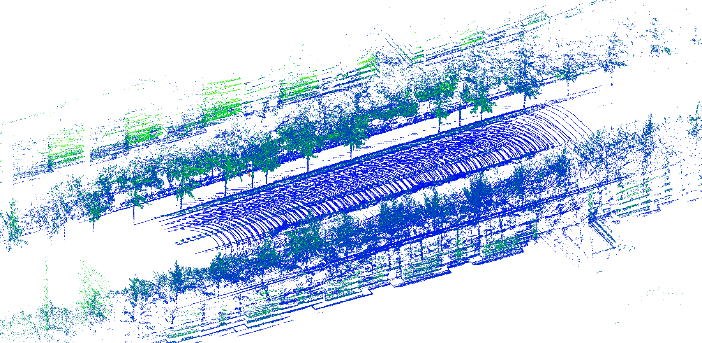
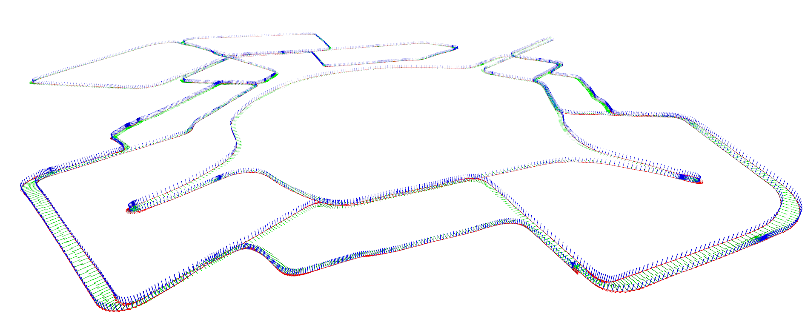
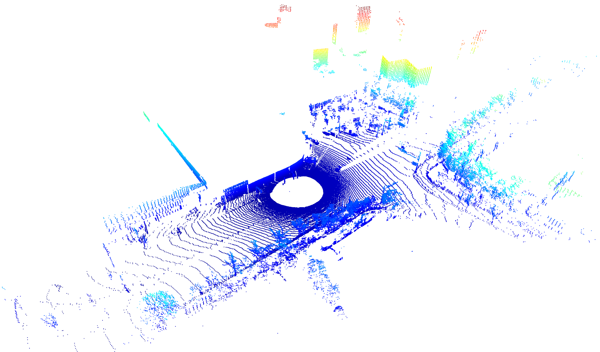

# HeLiPR Pointcloud Toolbox

## Overview
The HeLiPR Pointcloud Toolbox is a sophisticated software suite tailored for processing and analyzing the HeLiPR (Heterogeneous LiDAR Place Recognition) dataset. This toolbox offers robust functionalities for manipulating point cloud data from various LiDAR sensors, making it an essential tool for researchers in place recognition, SLAM (Simultaneous Localization and Mapping), and other related fields.

- For the HeLiPR dataset, visit: [HeLiPR Dataset Site](https://sites.google.com/view/heliprdataset)
- For ROS message usage from the HeLiPR dataset, refer to: [HeLiPR File Player Repository](https://github.com/minwoo0611/helipr_file_player)

<p align="center">
  
  
  
</p>

The HeLiPR-Pointcloud-Toolbox excels with three core functionalities: 

- **Undistortion and Accumulation** for refining point cloud data

- **Frame Transformation** to align data with the coordinate system

- **Visualization** for a comprehensive graphical representation of LiDAR data.

## Files and Functions
- **`python/transformINStoLiDAR.py`**: Transforms INS data to the LiDAR frame, aiding in trajectory creation and undistortion.
  - **Input**: CSV file with latitude, longitude, altitude data (Inertial_data.csv from HeLiPR dataset).
  - **Output**: Text file with trajectory data in LiDAR frame.
  
- **`python/binVisualizer.py`**: Visualize the bin file using open3d.
  - **Input**: bin file from HeLiPR dataset.
  - **Output**: visualize the 3D pointcloud via open3d.

- **`src/PointCloudProcessor.cpp`**: Processes point clouds from LiDAR data.
  - **Function**: Converts bin data to undistorted point clouds, accumulates them based on user-defined thresholds.
  - **Input**: Bin files from specific LiDAR and trajectory file from `python/transformINStoLiDAR.py`.
  - **Output**: Undistorted and accumulated point clouds.

## Features
- **Versatile LiDAR Data Processing**: Supports Ouster, Velodyne, Livox, and Aeva LiDAR types in the HeLiPR dataset.
- **Point Cloud Undistortion**: Implements BsplineSE3 for trajectory interpolation, undistorts point clouds accordingly.
- **Point Cloud Accumulation**: Accumulates multiple point cloud scans with user-defined thresholds, aiding in place recognition tasks.
- **Point Cloud Saver**: Save pointcloud with accumulation or undistortion with user-defined distances, aiding in place recognition tasks.
- **Efficient File Handling**: Reads `.bin` files from different LiDAR types and outputs processed data in `.pcd` format.
- **Interactive User Experience**: Prompts for input paths and processing parameters for a customized workflow with visual progress tracking such as progress bar and visualizer.
- **Trajectory Interpolation**: Accurately interpolates trajectory data for precise point cloud mapping.


For a README file, the instructions should be clear, concise, and well-structured. Here's how you can rewrite the usage instructions for the HeLiPR-Pointcloud-Toolbox in a README-friendly format:

---

## Initial Setup

**Buiild and Compile**: 
Clone and compile the HeLiPR-Pointcloud-Toolbox repository using git.
```bash
git clone https://github.com/minwoo0611/HeLiPR-Pointcloud-Toolbox
cd HeLiPR-Pointcloud-Toolbox
mkdir build && cd build
cmake ..
make
./helipr_tool
```

## Usage
0. **Visualize Individual Scans**: To visualize each scan from various LiDAR sensors, use the `python/binVisualizer.py` script.
1. **Create Trajectory**: Execute `python/transformINStoLiDAR.py` to transform INS trajectory data to each LiDAR frame.
2. **Compilation and Execution**: Compile and run the PointCloudProcessor C++ code.
3. **Set Parameters**: Input paths to `.bin` files, trajectory file, and specify LiDAR type and other parameters.
4. **Data Processing**: Processes the input data, undistorts point clouds, and accumulates them based on set criteria.
5. **Output Generation**: Outputs the processed point clouds in `.pcd` format at the designated location.

## Dependencies
- `Eigen`: For advanced mathematical operations, particularly with vectors and quaternions.
- `PCL (Point Cloud Library)`: Crucial for point cloud processing and file management.
- `Open3D`: Utilized in `python/*.py` for trajectory visualization.

## Notes
- Ensure all dependencies are properly installed and configured.
- Verify the compatibility of the tool with your LiDAR model and data format.
- The trajectory file is crucial for accurate undistortion; ensure its format aligns with the expectations of `python/transformINStoLiDAR.py`.

## License and Citation
- When using the dataset or code, please cite our paper:

```bibtex
@misc{jung2023helipr,
      title={HeLiPR: Heterogeneous LiDAR Dataset for inter-LiDAR Place Recognition under Spatial and Temporal Variations}, 
      author={Minwoo Jung and Wooseong Yang and Dongjae Lee and Hyeonjae Gil and Giseop Kim and Ayoung Kim},
      year={2023},
      eprint={2309.14590},
      archivePrefix={arXiv},
      primaryClass={cs.RO}
}
```

## Copyright Notice
All datasets are copyrighted by SNU RPM Labs and are distributed under the Creative Commons Attribution-NonCommercial-ShareAlike 4.0 License. This license requires proper attribution to the author for any use, prohibits commercial usage, and mandates that derivative works be licensed similarly.

## Maintainer
- Minwoo Jung (moonshot@snu.ac.kr, SNU RPM Lab)
- Last Revised: 2024/03/19

### Attribution for "down_sampling_voxel"

Part of our codebase, specifically the "down_sampling_voxel" function, is adapted from the [STD project](https://github.com/hku-mars/STD) hosted on GitHub.

